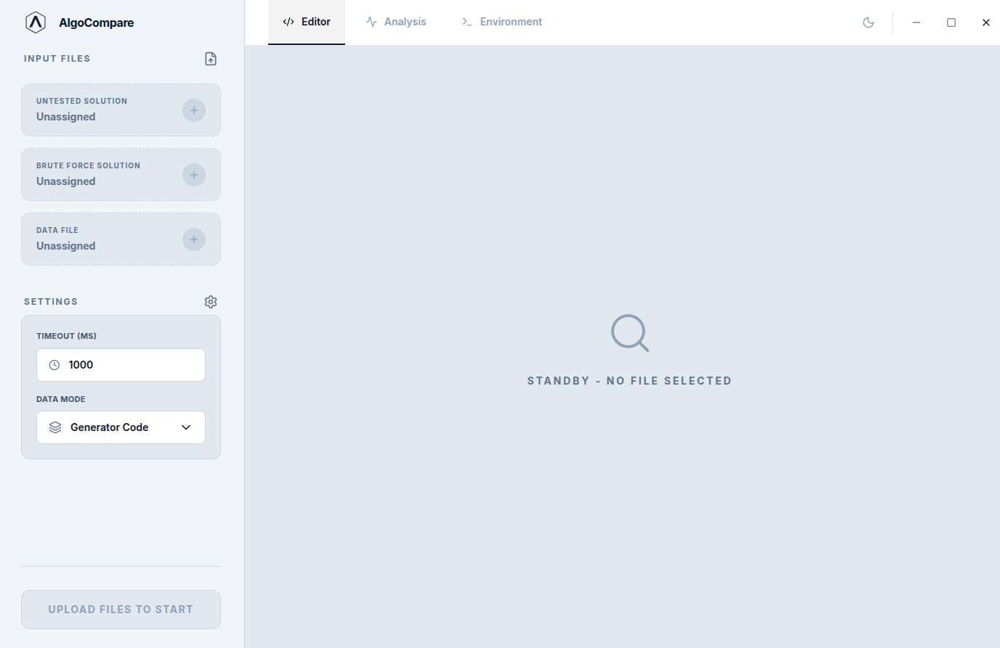
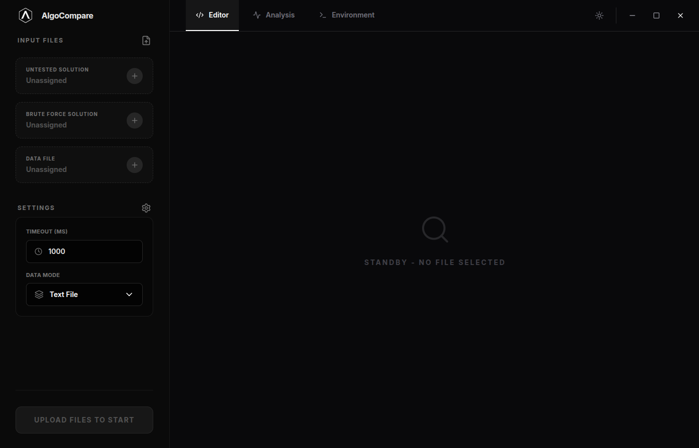
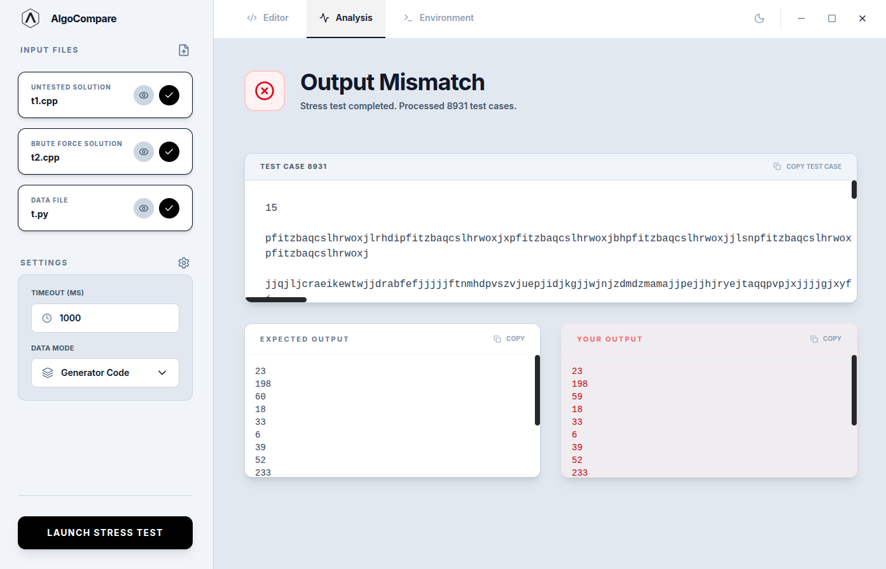
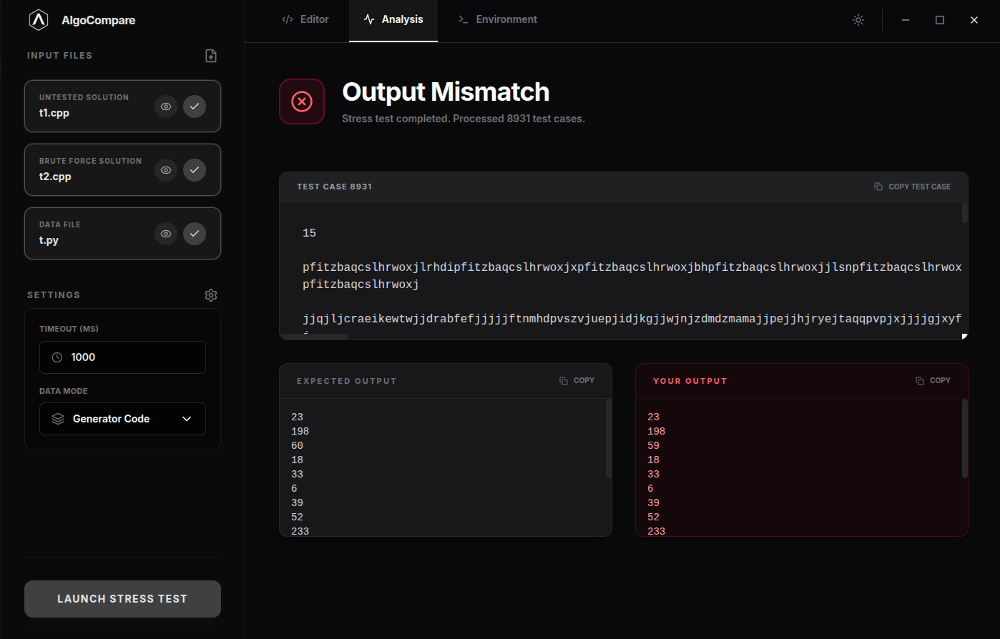

<p align="center">
  
</p>

<h1 align="center">AlgoCompare</h1>

<p align="center">
  <b>⚡ Stress test your competitive programming solutions — visually.</b><br/>
  Compare an untested solution against a brute-force reference across thousands of test cases in seconds.
</p>

<p align="center">
  <a href="https://machiamelli.github.io/Algo-Compare"></a>
  <a href="https://github.com/Machiamelli/Algo-Compare/releases"></a>
  <a href="#license"></a>
</p>

<p align="center">
  
</p>

---

## 📑 Table of Contents

- [🤔 Why AlgoCompare?](#-why-algocompare)
- [✨ Features](#-features)
- [📸 Screenshots](#-screenshots)
- [📦 Installation](#-installation)
  - [Download Pre-Built Binaries](#download-pre-built-binaries)
  - [Build from Source](#build-from-source)
- [🚀 How to Use](#-how-to-use)
  - [Quick Start](#quick-start)
  - [Static Mode](#static-mode-pre-defined-test-cases)
  - [Generator Mode](#generator-mode-infinite-random-testing)
  - [Test Case File Format](#test-case-file-format)
- [🌐 Supported Languages](#-supported-languages)
- [⚖️ Why AlgoCompare over a Shell Script?](#%EF%B8%8F-why-algocompare-over-a-shell-script)
- [🏗️ Architecture](#%EF%B8%8F-architecture)
- [📚 Documentation](#-documentation)
- [🤝 Contributing](#-contributing)
- [📄 License](#-license)

---

## 🤔 Why AlgoCompare?

In competitive programming, you often write an optimized solution and need to verify it against a brute-force approach. The traditional workflow involves writing cumbersome bash scripts or manually running programs side by side. **AlgoCompare** replaces that entire workflow with a polished desktop application:

1. 📂 **Upload** your untested solution, a brute-force reference, and either a test case file or a test generator.
2. 🚀 **Click Launch** — AlgoCompare compiles, runs, and compares outputs automatically.
3. 🔍 **Inspect results** — see the exact failing input, expected vs. actual output, TLE info, or compilation errors in a rich UI.

No more debugging shell scripts. No more forgetting to handle edge cases in your testing harness. Just upload and go. 🎯

---

## ✨ Features

### 🌍 Multi-Language Support

Run solutions written in **C++**, **Java**, and **Python** — and freely mix languages across slots. Test your Python brute force against a C++ optimized solution, or any combination.

### 🔄 Two Testing Modes

- 📋 **Static Mode** — supply a file of pre-defined test cases (separated by `---`). AlgoCompare streams through them one-by-one for memory efficiency.
- 🎲 **Generator Mode** — supply a generator program (in any supported language) that produces random inputs. AlgoCompare loops indefinitely until a mismatch is found or you stop it.

### 🔎 Automatic Compiler & Runtime Detection

AlgoCompare scans your system for installed compilers and interpreters at startup:

- **C++**: g++, clang++, MSVC (`cl.exe`) — checks PATH, MinGW, MSYS2, LLVM, Visual Studio
- **Java**: Any JDK (Oracle, OpenJDK, Adoptium, Corretto, Amazon, Microsoft) — checks `JAVA_HOME`, PATH, common install directories
- **Python**: Python 3.x — checks PATH, pyenv, Anaconda/Miniconda, system installs

View all detected environments in the **Environment** tab with version info and verification status.

### ✏️ Built-in Code Editor

Preview and edit uploaded files directly inside AlgoCompare with a full-featured **CodeMirror 6** editor:

- Syntax highlighting for C++, Java, and Python
- Line numbers, code folding, bracket matching
- Search & replace (Ctrl+F)
- Undo/redo history
- Save edits with Ctrl+S (writes back to the working copy)
- Dark and light themes

### 📊 Detailed Analysis Results

When a test fails, AlgoCompare shows you exactly what went wrong:

- ❌ **Mismatch** — side-by-side expected vs. actual output with the failing input
- ⏱️ **TLE (Time Limit Exceeded)** — identifies which solution timed out and on which test
- 💥 **Runtime Error** — shows stderr, exit code, and the input that caused the crash
- 🔧 **Compilation Error** — full compiler error output with the failing slot identified
- ✅ **All Tests Passed** — confirmation with total test count

### ⏳ Real-Time Progress Overlay

A live overlay during execution shows:

- 🔄 Current stage (compiling, running test N of M)
- ⏱️ Elapsed time counter
- 📊 Determinate progress bar (static mode) or pulsing indicator (generator mode)
- 🛑 One-click termination

### 💻 Cross-Platform

Runs on **Windows** and **Linux**. Built with Electron for native desktop integration including:

- 🪟 Custom frameless window with native-feel title bar
- 📁 OS-native file dialogs
- 🧹 Proper process cleanup on exit

### 🎨 Dark & Light Themes

Full dark and light theme support with smooth transitions. Your preference is persisted across sessions.

---

## 📸 Screenshots

<p align="center">
  
  
</p>
<p align="center">
  
  
</p>

---

## 📦 Installation

### 📥 Download Pre-Built Binaries

Grab the latest release for your platform:

| Platform | Format           | Download                                                                                                           |
| -------- | ---------------- | ------------------------------------------------------------------------------------------------------------------ |
| Windows  | `.exe` installer | [Download for Windows](https://github.com/Machiamelli/Algo-Compare/releases/latest/download/AlgoCompare-Setup.exe) |
| Linux    | `.AppImage`      | [Download for Linux](https://github.com/Machiamelli/Algo-Compare/releases/latest/download/AlgoCompare.AppImage)    |

**Windows (PowerShell):**

```powershell
# Download and run the installer
Invoke-WebRequest -Uri "https://github.com/Machiamelli/Algo-Compare/releases/latest/download/AlgoCompare.exe" -OutFile "AlgoCompare.exe"
Start-Process "AlgoCompare.exe"
```

**Linux:**

```bash
# Download, make executable, and run
curl -L "https://github.com/Machiamelli/Algo-Compare/releases/latest/download/AlgoCompare.AppImage" -o AlgoCompare.AppImage
chmod +x AlgoCompare.AppImage
./AlgoCompare.AppImage
```

### 🔨 Build from Source

**Prerequisites:**

- [Node.js](https://nodejs.org/) (v18 or later recommended)
- [npm](https://www.npmjs.com/) (comes with Node.js)
- At least one of: g++, clang++, javac, or python3 installed on your system

**Steps:**

```bash
# 1. Clone the repository
git clone https://github.com/Machiamelli/Algo-Compare.git
cd AlgoCompare

# 2. Install dependencies
npm install

# 3a. Run in development mode (hot-reload)
npm run electron:dev

# 3b. OR build for production
npm run electron:build
# Built artifacts will be in the release/ directory
```

**Available Scripts:**

| Command                  | Description                                                 |
| ------------------------ | ----------------------------------------------------------- |
| `npm run dev`            | Start Vite dev server only (no Electron)                    |
| `npm run build`          | Build the React frontend                                    |
| `npm run electron:dev`   | Start full Electron app in development mode with hot-reload |
| `npm run electron:build` | Build production binaries using electron-builder            |

---

## 🚀 How to Use

### ⚡ Quick Start

1. **Launch AlgoCompare** — open the application.
2. **Check the Environment tab** — verify that your compilers/interpreters are detected (green "VERIFIED" badges). If not, install the required toolchain and hit Refresh.
3. **Upload 3 files** via the sidebar:
   - **Slot A — Brute Force Solution**: your known-correct (but possibly slow) solution
   - **Slot B — Untested Solution**: the optimized solution you want to verify
   - **Data File**: either a test case file (static mode) or a generator program (generator mode)
4. **Configure settings**:
   - **Timeout (ms)**: time limit for Slot B per test case (default: 1000ms). Slot A has no time limit.
   - **Data Mode**: choose `Static` or `Generator`.
5. **Click "Launch Stress Test"** — sit back and watch the progress overlay.
6. **Review results** — the Analysis tab shows exactly what happened.

### 📋 Static Mode (Pre-Defined Test Cases)

Best for when you already have a set of test inputs:

1. Create a `.txt` file with test cases separated by `---` (see [format below](#test-case-file-format)).
2. Set **Data Mode** to `Static` in settings.
3. Upload the file in the **Data File** slot.
4. Launch — AlgoCompare runs both solutions on each test case sequentially and stops at the first mismatch.

### 🎲 Generator Mode (Infinite Random Testing)

Best for finding edge cases you haven't thought of:

1. Write a generator program (in C++, Java, or Python) that prints a random test input to stdout each time it runs.
2. Set **Data Mode** to `Generator` in settings.
3. Upload the generator in the **Data File** slot.
4. Launch — AlgoCompare compiles the generator, then loops: generate input → run both solutions → compare. It continues until a mismatch is found or you click **Terminate**.

### 📝 Test Case File Format

Test cases are separated by lines containing **three or more dashes** (`---`):

```
5
1 2 3 4 5
---
3
10 20 30
---
1
42
```

Each section between separators is one complete test input that gets piped to both solutions via stdin.

---

## 🌐 Supported Languages

| Language   | Compilers / Runtimes                                | Compilation                                           |
| ---------- | --------------------------------------------------- | ----------------------------------------------------- |
| **C++**    | g++, clang++, MSVC (cl.exe)                         | `-std=c++17`, unlimited stack size on Unix            |
| **Java**   | Any JDK (Oracle, OpenJDK, Adoptium, Corretto, etc.) | `javac` → `java -cp` (auto-detects public class name) |
| **Python** | Python 3.x only                                     | Interpreted (no compilation step)                     |

You can mix languages across slots. For example:

- Brute force in Python, untested solution in C++
- Generator in Python, both solutions in Java

AlgoCompare automatically detects the language from the file extension (`.cpp`, `.cc`, `.cxx`, `.java`, `.py`).

---

## ⚖️ Why AlgoCompare over a Shell Script?

| Concern                | Shell Script                                                         | AlgoCompare                                                       |
| ---------------------- | -------------------------------------------------------------------- | ----------------------------------------------------------------- |
| **Language mixing**    | Manually handle compilation and execution commands for each language | Automatic — detects language and uses the right compiler          |
| **Compiler detection** | Hardcode paths or hope it's in PATH                                  | Scans your entire system, shows what's available                  |
| **Error handling**     | Parse exit codes, capture stderr, handle TLE with `timeout` command  | Structured error types with full context shown in the UI          |
| **Output comparison**  | Write `diff` logic, handle trailing whitespace/newlines              | Normalized comparison (trims lines, ignores trailing blanks)      |
| **Progress feedback**  | Manually echo progress, no progress bar                              | Real-time overlay with progress bar, elapsed time, test counter   |
| **Debugging failures** | Scroll through terminal output to find the failing case              | Side-by-side expected vs. actual, exact failing input highlighted |
| **Generator mode**     | Write the loop yourself, handle process cleanup                      | Built-in infinite loop with clean termination                     |
| **Process cleanup**    | Orphan processes on Ctrl+C without careful `trap` usage              | Kills entire process groups on exit, clean temp directory removal |
| **Cross-platform**     | Rewrite for PowerShell on Windows                                    | Works on both Windows and Linux out of the box                    |
| **Reusability**        | Copy-paste scripts between problems                                  | Same app for every problem, every contest                         |

---

## 🏗️ Architecture

AlgoCompare is built with a modern Electron + React stack:

```
┌──────────────────────────────────────────────────┐
│                  Electron Main                   │
│                                                  │
│  ┌──────────┐  ┌───────────┐  ┌──────────────┐   │
│  │ Detection│  │ Execution │  │ File Manager │   │
│  │  Layer   │  │  Engine   │  │              │   │
│  └────┬─────┘  └─────┬─────┘  └──────┬───────┘   │
│       │              │               │           │
│       └──────────┬───┘───────────────┘           │
│                  │                               │
│           ┌──────┴──────┐                        │
│           │  IPC Layer  │                        │
│           └──────┬──────┘                        │
│                  │ contextBridge                 │
├──────────────────┼───────────────────────────────┤
│                  │                               │
│  ┌───────────────┴───────────────────────┐       │
│  │          React Frontend               │       │
│  │                                       │       │
│  │  Services → Hooks → Components        │       │
│  │                                       │       │
│  │  ┌─────────┐ ┌────────┐ ┌─────────┐   │       │
│  │  │ Sidebar │ │ Editor │ │ Results │   │       │
│  │  └─────────┘ └────────┘ └─────────┘   │       │
│  └───────────────────────────────────────┘       │
│                                                  │
│               Renderer Process                   │
└──────────────────────────────────────────────────┘
```

**🧰 Tech Stack:**

| Layer              | Technology            |
| ------------------ | --------------------- |
| Desktop runtime    | Electron 40           |
| Frontend framework | React 19 + TypeScript |
| Styling            | Tailwind CSS 4        |
| Code editor        | CodeMirror 6          |
| Animations         | Framer Motion         |
| Icons              | Lucide React          |
| Build tool         | Vite 6                |
| Packaging          | electron-builder      |

---

## 📚 Documentation

| Resource               | Link                                                                                       |
| ---------------------- | ------------------------------------------------------------------------------------------ |
| Website & Landing Page | [https://machiamelli.github.io/Algo-Compare](https://machiamelli.github.io/Algo-Compare)   |
| GitHub Repository      | [https://github.com/Machiamelli/Algo-Compare](https://github.com/Machiamelli/Algo-Compare) |
| Releases & Downloads   | [GitHub Releases](https://github.com/Machiamelli/Algo-Compare/releases)                    |
| Issue Tracker          | [GitHub Issues](https://github.com/Machiamelli/Algo-Compare/issues)                        |

---

## 🤝 Contributing

Contributions are welcome! Here's how to get started:

1. **Fork** the repository
2. **Create a branch** for your feature or fix: `git checkout -b feature/my-feature`
3. **Make your changes** and test them with `npm run electron:dev`
4. **Commit** with a clear message: `git commit -m "Add: my new feature"`
5. **Push** to your fork: `git push origin feature/my-feature`
6. **Open a Pull Request** against `main`

Please ensure your code follows the existing patterns and style.

---

## 📄 License

This project is licensed under the **MIT License** — see the [LICENSE](LICENSE) file for details.

Copyright © 2026 [Machiamelli](https://github.com/Machiamelli)

---

<p align="center">
  <b>🏆 Built for competitive programmers, by a competitive programmer.</b><br/>
  If AlgoCompare helped you find a bug, consider giving the repo a ⭐
</p>
